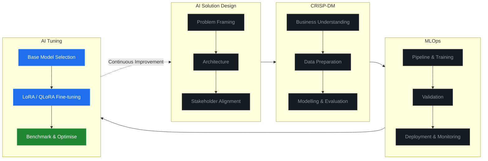
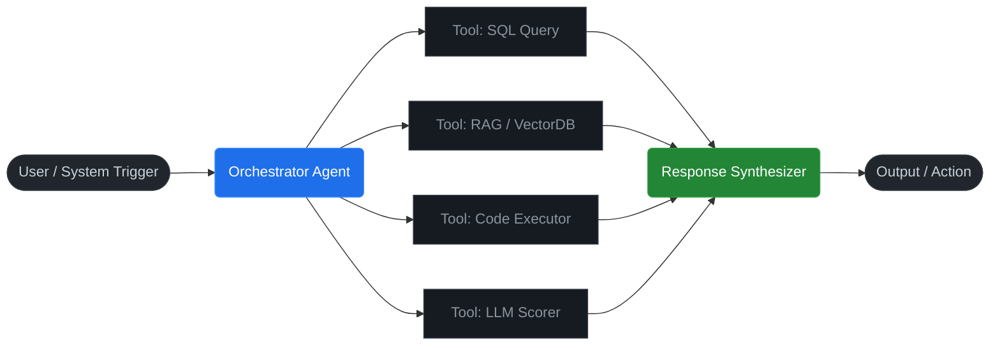

<div align="center">


<br/>

[](https://linkedin.com/in/mydennis-ee)
[](mailto:mydennis.ee@gmail.com)
[](https://maps.google.com/?q=Kuala+Lumpur)
[](https://github.com/mydennisee)

</div>

---

> **Defines the problem, architects the solution, owns the outcome.**
> Five years of applied AI across regulated industries — from data pipeline to the executive suite.
> MBA candidate, University of Malaya.

---

## Capabilities

<table>
<tr>
<td align="center" width="33%">

### 🤖 Agentic AI
Autonomous & multi-agent system design
LLM/VLM fine-tuning (LoRA / QLoRA)
RAG pipeline engineering
GPU-accelerated deep learning
Prompt engineering & benchmarking

</td>
<td align="center" width="33%">

### 🎯 Strategic AI Delivery
End-to-end solution design & architecture
Explainable AI & governance
Executive & board communication
Business case development & ROI framing
A/B test design & pilot validation

</td>
<td align="center" width="33%">

### ⚙️ Data Engineering
PySpark / Hadoop ETL/ELT pipelines
Feature store & SCD-2 design
Terabyte-scale data processing
Data modelling & warehousing
Performance & SQL optimisation

</td>
</tr>
</table>

---

## Delivery Methodology



---

## Tech Stack

**Languages & Core**


**AI / ML**


**LLM / GenAI**


**Data Engineering**


---

## Agentic AI — System Architecture



---

## Selected Work

<table>
<tr>
<td width="33%" valign="top">

### 🤖 Agentic Systems Research
Autonomous multi-agent architectures with LoRA / QLoRA fine-tuning on dedicated GPU infrastructure. Focused on production-grade agentic system design and LLM/VLM deployment.

`Python` `CUDA` `HuggingFace` `LoRA` `QLoRA`

</td>
<td width="33%" valign="top">

### 🔍 Intelligent Risk Analytics
Deployed segmentation and threshold optimisation methodology resulting in **~25% reduction in false positives**. Presented to C-suite and regulatory bodies with full model explainability.

`PySpark` `K-Means` `SHAP` `Hadoop` `CRISP-DM`

</td>
<td width="33%" valign="top">

### 📊 Predictive Scoring Pipeline
Three-phase ML scoring system across prevention, intervention, and recovery. Targeted **5–10% reduction in flow rate**. Delivered with full A/B test design, pilot validation, and stakeholder sign-off.

`XGBoost` `SMOTE` `SHAP` `A/B Testing` `Python`

</td>
</tr>
</table>

---

## Currently

```text
Research      →  Agentic AI architecture · LLM/VLM fine-tuning · Multi-agent systems
Education     →  MBA, University of Malaya — Business Analytics
Position      →  AI Centre of Excellence
```

---

<div align="center">

[](https://linkedin.com/in/mydennis-ee)

*Available for strategic AI engagements.*

</div>
